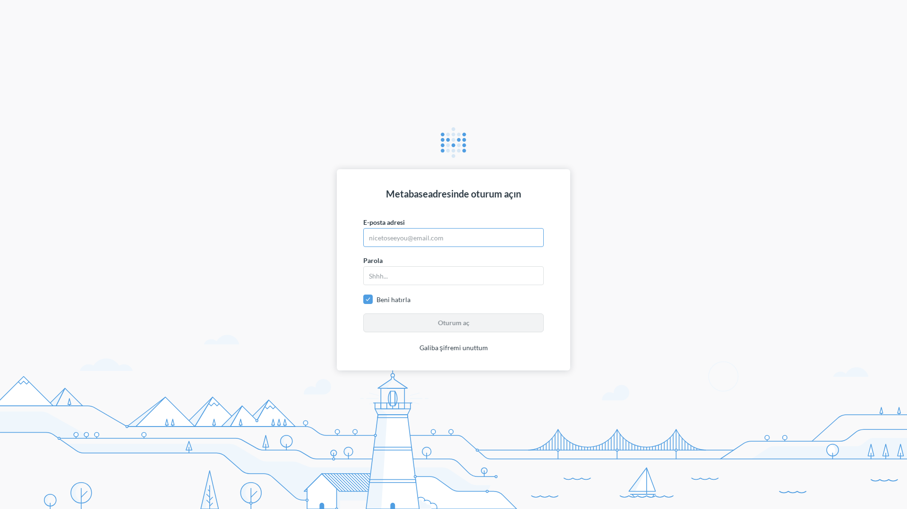
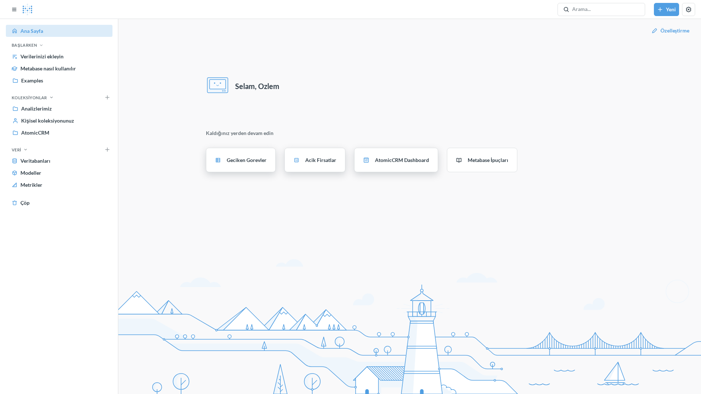
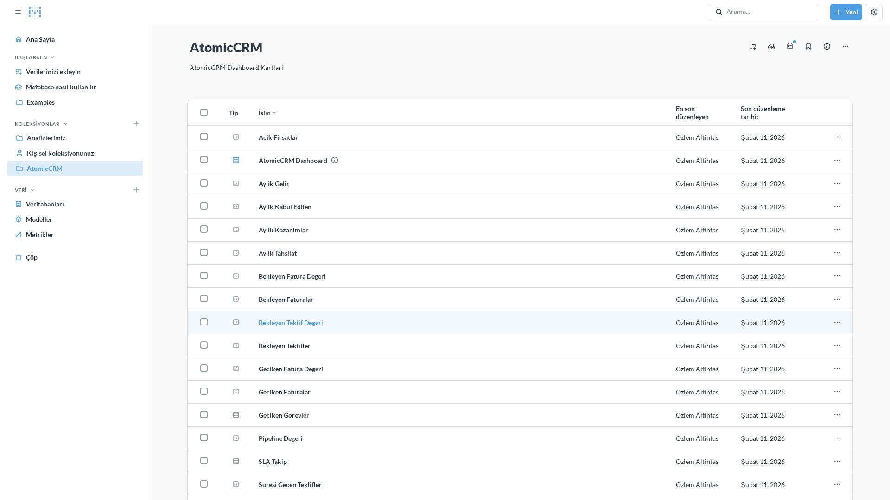
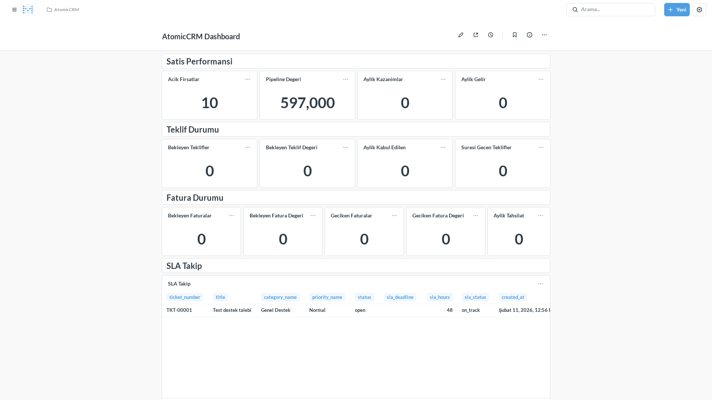
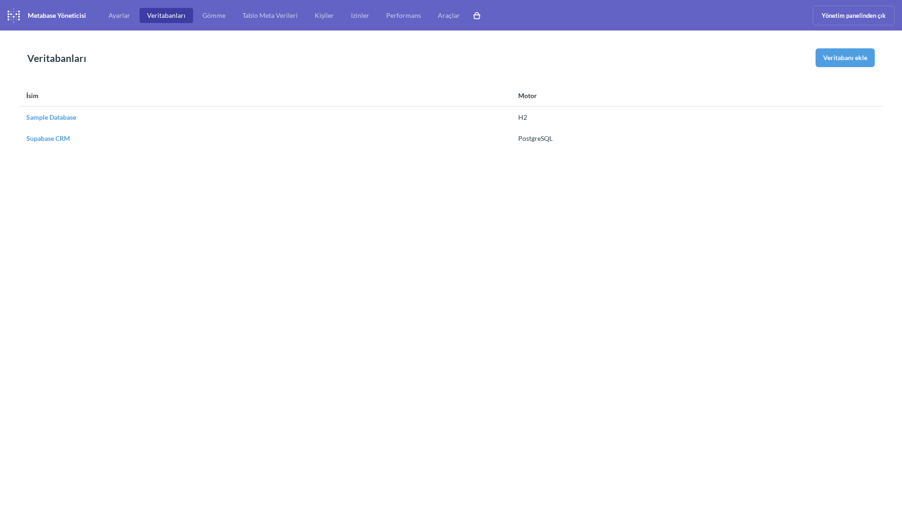

# AtomicCRM - Metabase Raporlama Modulu Proje Raporu

## 1. Proje Tanimi

### AtomicCRM Nedir?
AtomicCRM, Supabase PostgreSQL uzerinde calisan bir musteri iliskileri yonetim (CRM) sistemidir. Satis firsatlari, teklifler, faturalar, musteriler, gorevler ve destek biletleri gibi temel CRM islevlerini icerir. Veriler Supabase'de PostgreSQL veritabaninda tutulur ve cesitli view'lar araciligiyla raporlama icin hazir hale getirilir.

### Raporlama Modulu (Bu Proje)
Bu proje, AtomicCRM'in raporlama ihtiyacini karsilamak icin **Metabase** BI aracini **Coolify** uzerinde programatik olarak deploy etmeyi, Supabase PostgreSQL veritabanina baglamayi ve interaktif dashboard'lar olusturmayi kapsar.

### Kullanilan Teknolojiler
| Teknoloji | Versiyon | Rol |
|-----------|----------|-----|
| **Coolify** | v4.0.0-beta.442 | Self-hosted PaaS, servis yonetimi ve deploy |
| **Metabase** | v0.58.5.5 | Business Intelligence / raporlama araci |
| **Supabase** | - | Backend-as-a-Service (PostgreSQL, Auth, Storage) |
| **PostgreSQL** | 16-alpine | Metabase metadata DB (ayri instance) |
| **Docker** | - | Container runtime (Coolify tarafindan yonetiliyor) |
| **Traefik** | - | Reverse proxy, SSL ve domain yonetimi (Coolify icinde) |
| **sslip.io** | - | Wildcard DNS servisi (IP bazli otomatik domain) |

---

## 2. Mimari

```
┌─────────────────────────────────────────────────────────┐
│                    cx33 Sunucusu                        │
│                  (Coolify Server 1)                     │
│                                                         │
│  ┌──────────────┐    Docker Internal    ┌────────────┐ │
│  │   Metabase   │◄────Network──────────►│  Supabase  │ │
│  │  (BI Tool)   │  connect_to_docker_   │ PostgreSQL │ │
│  │  port: 3000  │  network: true        │ port: 5432 │ │
│  └──────┬───────┘                       └────────────┘ │
│         │                                               │
│  ┌──────▼───────┐                                      │
│  │  PostgreSQL   │                                      │
│  │  (Metadata)   │                                      │
│  │  16-alpine    │                                      │
│  └──────────────┘                                      │
│                                                         │
│  ┌──────────────┐                                      │
│  │   Traefik    │ ←── sslip.io domain                  │
│  │   (Proxy)    │                                      │
│  └──────────────┘                                      │
└─────────────────────────────────────────────────────────┘
```

**Onemli Mimari Kararlar:**
- Metabase ve Supabase **ayni sunucuda** (cx33) calisir. Farkli sunucularda Docker network izolasyonu nedeniyle birbirine erisemezler.
- Coolify'nin `connect_to_docker_network: true` ozelligi sayesinde servisler ayni Docker bridge network'u paylasiyor.
- Metabase kendi metadata'si (sorgu gecmisi, kullanici bilgileri vb.) icin **ayri bir PostgreSQL** (postgres:16-alpine) kullanir. CRM verisi icin Supabase PG'ye "database connection" olarak baglanir.

---

## 3. Ortam Bilgileri

| Bilgi | Deger |
|-------|-------|
| **Coolify API** | `http://<COOLIFY_IP>:8000/api/v1` |
| **Coolify Versiyonu** | v4.0.0-beta.442 |
| **Metabase URL** | `http://metabase-<SERVICE_UUID>.<COOLIFY_IP>.sslip.io` |
| **Metabase Versiyonu** | v0.58.5.5 |
| **Sunucu** | cx33 (Coolify Server 1) |
| **Supabase PG** | Ayni sunucuda, Docker internal network ile bagli |

> Gercek IP adresleri ve UUID'ler icin Coolify Dashboard'a bakin. Bu dokumanda guvenlik nedeniyle placeholder kullanilmaktadir.

---

## 4. Onemli ID'ler ve Referanslar

| Kaynak | ID / Aciklama |
|--------|---------------|
| **Metabase Service UUID** | Coolify Services > metabase-crm |
| **Supabase Service UUID** | Coolify Services > supabase |
| **cx33 Server UUID** | Coolify Servers > cx33 |
| **Metabase DB ID (Supabase baglantisi)** | `3` |
| **Dashboard ID** | `2` |
| **Collection ID (AtomicCRM)** | `5` |
| **Sorgu (Question) ID'leri** | `54` - `69` (16 sorgu) |

---

## 5. Metabase Admin Giris Bilgileri

- **E-posta**: Coolify ortam degiskenlerinden veya yerel notlardan alin
- **Sifre**: Rotate edilmis sifre, yerel notlarda sakli

> ⚠ Credential'lar bu dosyada saklanmaz. Yerel ortamda guvenli bir yerde tutun.
> Metabase admin sifresi 2026-02-11 tarihinde rotate edilmistir.

---

## 6. Supabase PG Baglanti Bilgileri

| Parametre | Deger |
|-----------|-------|
| **Host** | Supabase DB container adi (Coolify icinden) |
| **Port** | `5432` |
| **Database** | `postgres` |
| **User** | `postgres` |
| **Password** | Coolify Supabase service env'lerinden alin |

> ⚠ Supabase PG sifresi rotate edilememistir. Supabase 15+ birbiriyle bagli servis kullanir (supabase_admin, authenticator, supabase_auth_admin vb.) ve tek bir env var (SERVICE_PASSWORD_POSTGRES) ile yonetilir. Sifre degisikligi tum servisleri etkiler ve dikkatli bir operasyon gerektirir. Detay icin "Guvenlik" bolumune bakin.

---

## 7. Sync Edilen Veritabani Yapisi

Metabase, Supabase PG'deki **95 tablo/view**'i sync etmistir:
- 42 public tablo
- 6 dashboard view
- Diger schemalardan tablolar

### Dashboard View'lari

| View | Metabase Table ID | Aciklama |
|------|-------------------|----------|
| `v_dashboard_sales_kpis` | 21 | Satis KPI metrikleri (acik firsatlar, pipeline, gelir) |
| `v_dashboard_quotes` | 11 | Teklif istatistikleri (bekleyen, kabul edilen, suresi gecen) |
| `v_dashboard_invoices` | 12 | Fatura istatistikleri (bekleyen, geciken, tahsilat) |
| `v_ticket_sla` | 76 | Destek bileti SLA takip tablosu |
| `v_overdue_tasks` | 41 | Geciken gorevler listesi |
| `v_upcoming_tasks` | 94 | Yaklasan gorevler listesi |

---

## 8. Dashboard ve Sorgular

### Collection: AtomicCRM (ID: 5)
Tum sorgular ve dashboard bu collection altinda organize edilmistir.

### Dashboard: AtomicCRM Dashboard (ID: 2)
Dashboard, 22 karttan olusur: 6 baslik karti + 13 KPI scalar sorgu + 3 detay tablosu.

### Olusturulan Sorgular (16 Adet)

#### Satis KPI'lari (v_dashboard_sales_kpis)
| Sorgu | Card ID | Tip | Aciklama |
|-------|---------|-----|----------|
| Acik Firsatlar | 54 | Scalar (count) | Acik durumdaki satis firsatlarinin sayisi |
| Pipeline Degeri | 55 | Scalar (sum) | Toplam pipeline'daki TL degeri |
| Aylik Kazanimlar | 56 | Scalar (count) | Bu ayki kapanan firsatlar |
| Aylik Gelir | 57 | Scalar (sum) | Bu ayki kazanilan gelir (TL) |

#### Teklif KPI'lari (v_dashboard_quotes)
| Sorgu | Card ID | Tip | Aciklama |
|-------|---------|-----|----------|
| Bekleyen Teklifler | 58 | Scalar (count) | Onay bekleyen tekliflerin sayisi |
| Bekleyen Teklif Degeri | 59 | Scalar (sum) | Bekleyen tekliflerin toplam TL degeri |
| Aylik Kabul Edilen | 60 | Scalar (count) | Bu ay kabul edilen teklifler |
| Suresi Gecen Teklifler | 61 | Scalar (count) | Gecerlilik suresi dolmus teklifler |

#### Fatura KPI'lari (v_dashboard_invoices)
| Sorgu | Card ID | Tip | Aciklama |
|-------|---------|-----|----------|
| Bekleyen Faturalar | 62 | Scalar (count) | Odenmemis faturalarin sayisi |
| Bekleyen Fatura Degeri | 63 | Scalar (sum) | Odenmemis faturalarin toplam TL degeri |
| Geciken Faturalar | 64 | Scalar (count) | Vadesi gecmis fatura sayisi |
| Geciken Fatura Degeri | 65 | Scalar (sum) | Vadesi gecmis faturalarin TL degeri |
| Aylik Tahsilat | 66 | Scalar (sum) | Bu ay tahsil edilen tutar (TL) |

#### Detay Tablolari
| Sorgu | Card ID | Tip | Aciklama |
|-------|---------|-----|----------|
| SLA Takip Tablosu | 67 | Table (v_ticket_sla) | Destek biletlerinin SLA durumlari |
| Geciken Gorevler | 68 | Table (v_overdue_tasks) | Suresi gecmis gorevlerin listesi |
| Yaklasan Gorevler | 69 | Table (v_upcoming_tasks) | Yaklasan gorevlerin listesi |

### Dashboard Yerlesimi
Dashboard 18 sutunluk grid uzerine yerlestirilmistir:
- **Baslik kartlari**: Tam genislik (18 sutun), her bolumu ayiran renkli basliklar
- **KPI kartlari**: 4'er veya 5'er sutun genisliginde, 3 satir yuksekliginde
- **Tablo kartlari**: Tam genislik (18 sutun), 8 satir yuksekliginde

---

## 9. Deploy Adimlari (Kronolojik)

### Adim 1: Coolify API Token Dogrulama ✅
- Kullanicidan API token alindi
- `GET /api/v1/version` ile dogrulandi → v4.0.0-beta.442

### Adim 2: Coolify Kaynaklarini Kesfet ✅
- **Sunucular**: localhost (server 0, Coolify host), cx33 (server 1)
- **Projeler**: "My first project", "n8n"
- **Mevcut Servisler**: n8n, pgbackweb, pgadmin, supabase, teable, metabase-crm (onceden vardi)

### Adim 3: Supabase PG Baglanti Bilgilerini Al ✅
- Coolify API uzerinden Supabase servisinin environment variable'larindan PG bilgileri cekildi
- Host (container adi), port, user, password, database bilgileri elde edildi

### Adim 4: Metabase Deploy ✅
- Docker Compose hazirlanip base64 encode edildi
- `POST /api/v1/services` ile Coolify'a gonderildi
- `connect_to_docker_network: true` etkinlestirildi
- Servis baslatildi, `running:healthy` durumuna ulasti

### Adim 5: Domain / Proxy Yapilandirmasi ✅
- sslip.io ile otomatik domain atandi
- Traefik proxy uzerinden HTTP erisim saglandi

### Adim 6: Metabase Kurulum ve DB Baglantisi ✅
- `POST /api/setup` ile admin hesabi olusturuldu
- `POST /api/database` ile Supabase PG baglantisi eklendi (DB ID: 3)
- Sync tamamlandi: 95 tablo/view kesfedildi

### Adim 7: Dashboard Olusturma ✅
- AtomicCRM collection olusturuldu (ID: 5)
- 16 sorgu olusturuldu (Card ID: 54-69)
- Dashboard olusturuldu (ID: 2)
- 22 kart (6 baslik + 16 veri karti) dashboard'a yerlestirildi

### Adim 8: Dogrulama ✅
- Metabase login sayfasi erisilebilir
- Admin girisi basarili
- Supabase veritabani baglanmis ve sync tamamlanmis
- Dashboard canli veri gosteriyor
- Veri dogrulamasi: Acik Firsatlar: 10, Geciken Gorevler: 9, SLA Kayitlari: 1

---

## 10. Karsilasilan Sorunlar ve Cozumler

### Sorun 1: Docker Network Izolasyonu
- **Problem**: Metabase (server 0) Supabase PG'ye (server 1) erisemediydi
- **Sebep**: Coolify farkli "server"lardaki servisleri farkli Docker network'lere koyuyor. External network tanimlamak da Coolify tarafindan override ediliyor.
- **Cozum**: Metabase'i Supabase ile ayni sunucuya (cx33) deploy edip `connect_to_docker_network: true` etkinlestirildi

### Sorun 2: Metabase Admin Sifre Uyumsuzlugu
- **Problem**: Onceden var olan metabase-crm servisinin admin sifresi bilinmiyordu
- **Cozum**: Eski servis silindi, yeniden olusturuldu, setup API ile temiz kurulum yapildi

### Sorun 3: Setup API Database Ekleme Hatasi
- **Problem**: `POST /api/setup` endpoint'inde database parametreleri verilmesine ragmen veritabani eklenmedi
- **Cozum**: Setup sonrasi ayri bir `POST /api/database` cagrisi ile manuel ekleme yapildi

### Sorun 4: Coolify docker_compose_raw Formati
- **Problem**: Ham YAML gonderildiginde validasyon hatasi alindi
- **Cozum**: docker_compose_raw alaninin base64 encode edilmesi gerektigini kesfedip uyguladik

### Sorun 5: DB Baglantisi Kaybi (Restart Dongusu)
- **Problem**: Guvenlik operasyonlari sirasinda Supabase restart dongulerinden sonra Metabase'in DB baglantisi koptu (DB ID: 2 silindi)
- **Cozum**: Yeni baglanti olusturuldu (DB ID: 3), tum 16 sorgu yeniden olusturuldu (ID: 54-69), dashboard guncellendi

---

## 11. Guvenlik

### Credential Leak Olayi (2026-02-11)
- **Ne Oldu**: Proje raporu dosyasi (tasks/PROJE_RAPORU.md) GitHub'a Coolify API token, Metabase admin sifresi, Supabase PG sifresi ve sunucu IP'leri ile birlikte push edildi.
- **Mudahale**:
  1. Commit derhal revert edildi
  2. Rapor placeholder'larla yeniden yazildi
  3. Git gecmisi `git reset --soft` + `--force-with-lease` ile temizlendi (hassas commit tamamen silindi)
  4. `.gitignore` genisletildi (env, key, credential dosyalari)
  5. `~/.claude/CLAUDE.md`'ye zorunlu pre-commit secret scanning kurallari eklendi

### Credential Rotation Durumu
| Credential | Rotate Edildi Mi? | Aciklama |
|-----------|-------------------|----------|
| Metabase Admin Sifresi | ✅ Evet | Yeni sifre olusturuldu |
| Coolify API Token | ❌ Hayir | Dashboard'dan manual olusturulmali |
| Supabase PG Sifresi | ❌ Hayir | 15+ servis arasindaki bagimlilik nedeniyle rotate edilemedi (detay asagida) |

### Supabase PG Sifre Rotasyonu Neden Yapilamadi
Supabase mimarisi tek bir `SERVICE_PASSWORD_POSTGRES` env var ile birden fazla PG kullanicisini yonetiyor:
- `postgres`
- `supabase_admin`
- `authenticator`
- `supabase_auth_admin`
- ve diger internal kullanicilar

Sadece env var'i degistirmek, mevcut PG data volume'undaki sifreleri degistirmiyor. ALTER USER ile tek bir kullaniciyi degistirmek de diger servislerin (supabase-analytics vb.) calismamasina neden oluyor. Guvenli rotation icin:
1. SSH ile sunucuya erisim gerekli
2. Tum PG kullanicilarin sifreleri ayni anda ALTER USER ile degistirilmeli
3. Ardindan Coolify env var guncellenmeli
4. Tum Supabase servisleri yeniden baslatilmali

### Alinan Onlemler
- Her `git add` / `git commit` oncesi secret scanning zorunlu hale getirildi
- `.gitignore` genisletilerek `.env`, `*.pem`, `*.key`, `credentials.json` vb. eklendi
- `~/.claude/CLAUDE.md`'ye kalici kurallar yazildi (tum Claude Code oturumlari icin gecerli)
- `tasks/lessons.md` dosyasi olusturuldu

---

## 12. Ekran Goruntuleri

### Metabase Login Sayfasi


### Ana Sayfa (Giris Sonrasi)


### AtomicCRM Collection (Tum Sorgular)


### AtomicCRM Dashboard (KPI'lar ve Tablolar)


### Veritabani Yonetimi (Supabase CRM Baglantisi)


---

## 13. Dosya Yapisi


```
tasks/
├── PROJE_RAPORU.md     ← Bu dosya (proje raporu)
├── todo.md             ← Gorev listesi (tum adimlar tamamlandi)
├── lessons.md          ← Ogrenilen dersler ve hata kayitlari
└── screenshots/        ← Ekran goruntuleri
    ├── 01-login-page.png
    ├── 02-home.png
    ├── 03-collection.png
    ├── 04-dashboard-top.png
    └── 07-databases.png
```

---

## 14. Tarihce

| Tarih | Olay |
|-------|------|
| 2026-02-11 | Proje baslatildi, Coolify API kesfedildi |
| 2026-02-11 | Metabase cx33'e deploy edildi, Supabase PG baglandi |
| 2026-02-11 | 16 sorgu + AtomicCRM Dashboard olusturuldu |
| 2026-02-11 | Credential leak tespit ve mudahale edildi |
| 2026-02-11 | Git gecmisi temizlendi, guvenlik onlemleri alindi |
| 2026-02-11 | Metabase admin sifresi rotate edildi |
| 2026-02-11 | DB baglantisi yeniden olusturuldu (ID: 2 → 3), sorgular yeniden olusturuldu (38-53 → 54-69) |

---

## 15. Durum

**TUM ADIMLAR TAMAMLANDI** ✅

- Metabase deploy ve running:healthy
- Supabase PG bagli ve 95 tablo/view sync
- AtomicCRM Dashboard canli ve veri gosteriyor
- Guvenlik onlemleri uygulanmis
- Metabase admin sifresi rotate edilmis
